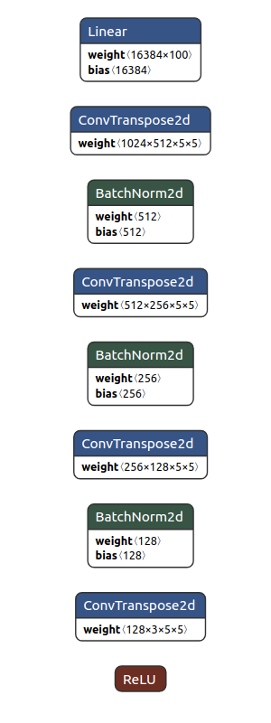
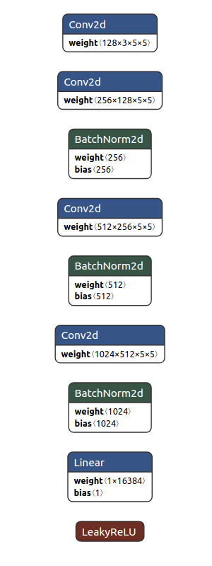

# Introduction

This repository implements the 4-layer DCGAN with Pytorch on [Anime-Face-Dataset](https://github.com/bchao1/Anime-Face-Dataset) to generate 64 x 64 images.

## Generator
Generator takes random input vectors with dimension (Batch_size, 100) and converts to (Batch_size, 64, 64, 3) images by 4 layers of TransposeConv2d-BatchNormalization.  
   

## Discriminator
Discriminator takes the output of Generator and predicts it's true or false.  


# Installation
```bash
git clone https://github.com/MingyuLi19910814/DCGAN-Anime-Face-Generator-Pytorch.git
cd DCGAN-Anime-Face-Generator-Pytorch
conda env create -f environment.yml
conda activate pytorch
```

# Train on Anime-Face-Dataset:
Download **data.tgz** from the [link](https://drive.google.com/file/d/1HG7YnakUkjaxtNMclbl2t5sJwGLcHYsI/edit) and save to this directory.  
```bash
mkdir train-images
tar xvzf data.tgz --directory train-images
python train.py
```
The generated model and images of every epoch will be saved in folder "generated_images"

# Train on custom dataset:
modify **global_cfg.data_path** to your image folder in [config.py](config.py)
```
python train.py
```

# Generate Anime Faces
```
python inference.py --num_images 128
```
# Generated Samples from Epoch 1 to 150

